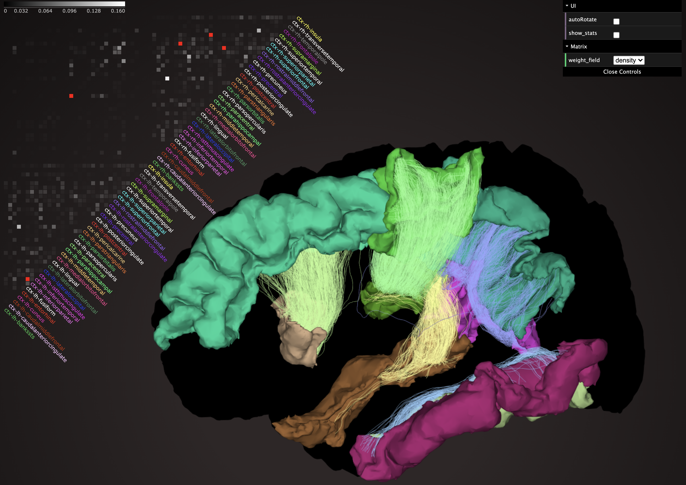

# Network Neuroscience Visualizer
This is a unique visualizer that simultaneously shows a matrix of structural connections and the anatomy of the connections.

[Demo on brainlife.io](https://brainlife.io/ui/nnview/) | [brainlife.io DOI](https://doi.org/10.25663/brainlife.ui.3)

### Authors
- [Soichi Hayashi](hayashis@iu.edu)

### Contributors
- [Franco Pestilli](frakkopesto@gmail.com)

### Funding Acknowledgement
brainlife.io is publicly funded and for the sustainability of the project, it is helpful to Acknowledge the use of the platform. We kindly ask that you acknowledge the funding below in your publications and reuse this code.

### Citations
We kindly ask that you cite the following articles when publishing papers and code using this code. 

1. Hayashi, S., Caron, B.A., Heinsfeld, A.S. et al. brainlife.io: a decentralized and open-source cloud platform to support neuroscience research. Nat Methods 21, 809–813 (2024). [https://doi.org/10.1038/s41592-024-02237-2](https://doi.org/10.1038/s41592-024-02237-2)

#### MIT Copyright (c) 2025 brainlife.io The University of Texas at Austin

